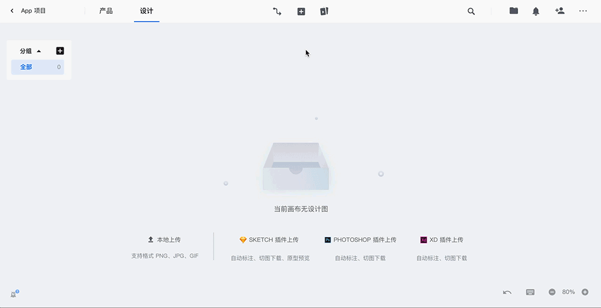
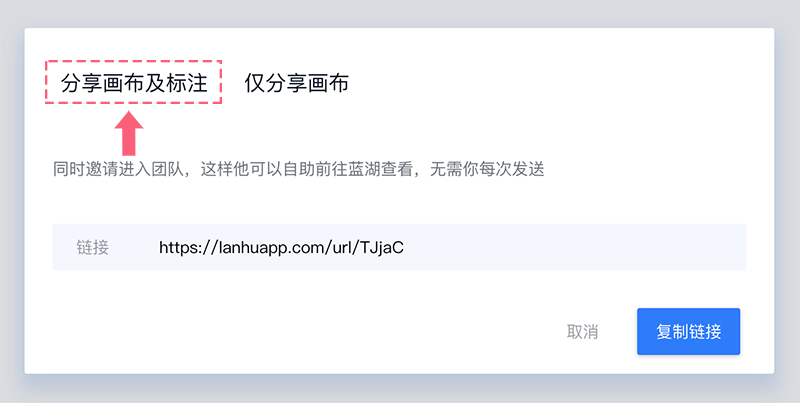
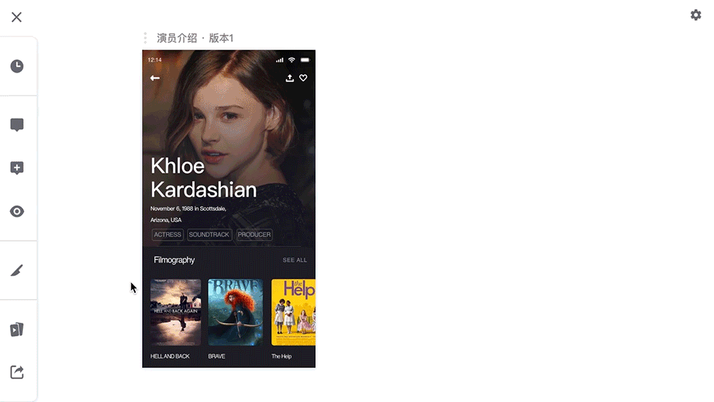
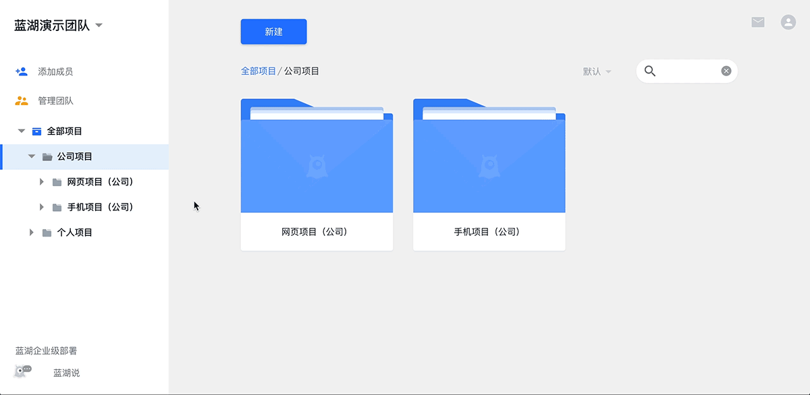

# 详细教程 test

## 一. 上传设计图

### 1.Sketch 插件

#### 1.1 安装插件

点击首页右上角的【个人设置】图标，打开后，点击【下载】，即可下载蓝湖 Sketch 插件；
安装成功后，请重启 Sketch。

👇[(下载蓝湖 Sketch 插件地址)](https://lanhuapp.com/mac)

#### 1.2 登录

打开 Sketch【Plugins】→【蓝湖】上传设计图；

👇

输入你的蓝湖账号、密码，登录蓝湖，选择设计图对应的团队和项目。

👇

#### 1.3 选择“当前设计”

插件内 “当前设计” 是指当前设计图的大小，根据设计图大小选择对应倍数。

确定当前设计基于的设备是 iOS、 Android 还是 Web,

再确定现在的设计图是基于几倍设计的，最后选择和设计图匹配的设备和倍数。

◆ 分类：

iPhone、iPad、iWatch 这三种设备的界面设计 属于—— iOS；

安卓系统的界面设计 属于 —— Android；

网页类型的界面设计 属于 —— Web。

👇

◆ 例如：

375 x 667， 属于 iOS 1x；

750 x 1334，属于 iOS 2x；

1920 x 1080, \(是手机界面还是网页 \)手机建议选 Android-xxhdpi；网页选 Web-1x。

◆ Web 类型：

1x,是常用尺寸，大家做的网页一般都是选 1x；

2x 是指为特定的屏幕（4k 屏）设计的尺寸，通常该尺寸会是正常网页的 2 倍。

#### 1.4 设置切图

通过蓝湖 Sketch / Photoshop / Adobe XD 插件标记需要生成的切图，上传设计图后，在设计图详情页，你家工程师就可以一键下载多倍数切图文件；

**1️⃣ 标记切图：**

👇

💗 以下切图教程以【B.切片类型切图】为例，且推荐此方法。

选中需要标记为切图的图标，点击 Sketch 右下角的 【Make Exportable】，然后再点击 Sketch 右下角的【切刀】图标，即可标记切图；

或者使用快捷键【S】，鼠标会显示成切刀工具，此时鼠标右键需要标记为切图的图标，即可标记切图。

👇

**2️⃣ 自定义切图尺寸**

当设计图上的切图尺寸不合适的时候，可以自定义切图尺寸。
选中需要自定义尺寸的图标，在右上角的图标尺寸栏中，输入合适的尺寸，然后再将该图标的切图图层跟原始图层合并成一个分组，即可成功自定义切图。

👇

✨PS：如果你标记的切图有背景图层，而此时你需要切图是透明背景，此时选中 Slice 层后，再在右侧菜单中勾选【Export group contents only】这个选项，即可得到是透明背景 的切图。

👇

#### 1.5 上传设计图

打开蓝湖插件，Sketch【Plugins】→【蓝湖】上传设计图；

可一键上传当前 page 内全部的 Artboard，也可以上传选中的 Artboard。

或使用快捷键，

“cmd + ctrl +L ” 上传当前 page 内全部画板，

“cmd + L ” 上传所选画板。

💌 设计图内切图较多会影响上传速度，请耐心等待，或取消不必要的切图，再次上传。

👇

#### 1.6 生成小程序代码

下载微信官方提供 Sketch 文件，然后基于 Sketch 文件内的 Symbols 设计的小程序设计图，上传到蓝湖之后，可以在标注详情页查看、复制相应的小组件对应的相关代码。

👇

#### 1.7 生成 SVG

插件右下角 “ 切图导出 SVG ”，勾选后上传的切图会自动生成 SVG 格式。

💌 注意：

1.需要被切图层是矢量的图层, 如形状图层和文本图层，图片图层不会输出 SVG 格式。

2.个别情况下有描边的矢量图标会导致导出错误，请把描边转为路径，后上传。

3.如果不需要使用 SVG 资源的时候，建议关闭 SVG 导出。

### 2.Photoshop 插件

#### 2.1 安装插件

点击首页右上角的【个人设置】图标，打开后，点击【下载】，即可下载蓝湖 Photoshop 插件；
安装成功后，请重启 Photoshop。

★ 注：蓝湖 Ps 插件仅支持 Photoshop CC 2015 及以上版本 。

👇[**（下载蓝湖 Photoshop 插件地址）**](https://lanhuapp.com/ps)

&nbsp;

#### 2.2 登录

打开 Photoshop【窗口】→【扩展功能】→【🐳 蓝湖】；

👇

输入蓝湖帐号、密码登录；

选择设计图要上传的团队与项目，点击【确定】 。

👇

#### 2.3 选择“当前设计”

插件内 “当前设计” 是指当前设计图的大小，根据设计图大小选择对应倍数。

确定当前设计基于的设备是 iOS、 安卓 还是 Web,

再确定现在的设计图是基于几倍设计的，最后选择和设计图匹配的设备和倍数。

◆ 分类：

iPhone、iPad、iWatch 这三种设备的界面设计 属于—— iOS；

安卓系统的界面设计 属于 —— 安卓；

网页类型的界面设计 属于 —— Web。

👇

◆ 例如：

375 x 667，属于 iOS 1x；

750 x 1334，属于 iOS 2x；

1920 x 1080, \(是手机界面还是网页 \)手机建议选 Android-xxhdpi；网页选 Web-1x。

◆ Web 类型：

1x,是常用尺寸，大家做的网页一般都是选 1x；

2x 是指为特定的屏幕（4k 屏）设计的尺寸，通常该尺寸会是正常网页的 2 倍。

#### 2.4 设置切图

选中切图的图层，或图层组，点击【标为切图】即可；

👇

数值是可选的，如果不填数值，默认使用当前图标内容的大小；

如果大小不是自己想要的，可自定义修改。

👇

PS：不勾选“显示切图区域”即可隐藏切图区域，该切图区域隐藏后，不影响切图的上传。

**💌 设置切图的图层或组，不可重复嵌套**

#### 2.5 上传设计图

选中要上传的画板，也可选择全部画板（无画板选全部画板），点击【上传】即可。

👇

设置好的切图，会跟随页面一同上传至蓝湖 Web 端，可看标注，并下载切图。

💌 注意：

1.蓝湖推荐使用 Ps 画板工具，可同时上传多个页面。

不建议使用 一个 psd 文件通过隐藏显示文件夹来区分不同页面，这样会导致上传的多张设计图成为设计图的历史版本，不便于以后的修改更新。

2.智能对象等同于位图，不会有标注内容和 SVG 格式切图

#### 2.6 生成 SVG

切图生成 SVG 格式需要被切图层是矢量的图层, 如形状图层和文本图层，但是图片图层、智能对象不能生成 SVG。

在打开“快速上传模式”之后，才能生成 SVG。

**快速上传模式** 🌱

快速上传模式是 v2.38 版新增的上传模式, 开启后可以更快的上传, 并且支持矢量图层生成 SVG 格式的切图,还能避免切图不对应等意外情况发生。

👇

**开启快速上传模式** 🌱

👇

> 💌 注意：
>
> v2.38 之前的版本不能通过插件内自动更新来获得快速上传功能,只能 [重新安装插件](https://lanhuapp.com/ps)
>
> 快速上传模式只能在 Photoshop CC 2017 以上版本使用.

● 打开: Photoshop 首选项-增效工具-启用生成器

● 在插件右上角的菜单中勾选"启用快速上传"

● 如果你有上传 SVG 的需求, 可以开启"导出 SVG", 如果不需要, 可以关闭它来提升上传速度。

👇

### 3.Adobe XD 插件

#### 3.1 安装插件

点击首页右上角的【个人设置】图标，打开后，点击【下载】，即可下载蓝湖 Adobe XD 插件；
安装成功后，启动 Adobe XD。

★ 注：蓝湖 Adobe XD 插件支持 Adobe XD cc 及以上版本，且支持 Windows 和 Mac 双系统。

👇[**（下载蓝湖 Adobe XD 插件地址）**](https://lanhuapp.com/xd)

&nbsp;

#### 3.2 登录

启动【蓝湖 XD】程序，输入你的蓝湖帐号、密码登录；

👇

★ 注：

如果你之前下载安装过【蓝湖 Photoshop 插件】，【蓝湖 XD】程序会自动获取你的帐号信息，团队和项目都是之前 Photoshop 内的设置，可自行修改；

如果你之前未使用过蓝湖，在蓝湖官网注册好帐号后，再登录【蓝湖 XD】程序。

蓝湖官网：[lanhuapp.com](http://lanhuapp.com/)

#### 3.3 选择“当前设计”

插件内 “当前设计” 是指当前设计图的大小，根据设计图大小选择对应倍数。

确定当前设计基于的设备是 iOS、 安卓 还是 Web,

再确定现在的设计图是基于几倍设计的，最后选择和设计图匹配的设备和倍数。

◆ 分类：

iPhone、iPad、iWatch 这三种设备的界面设计 属于—— iOS；

安卓系统的界面设计 属于 —— 安卓；

网页类型的界面设计 属于 —— Web。

👇

◆ 例如：

375 x 667，属于 iOS 1x；

750 x 1334，属于 iOS 2x；

1920 x 1080, \(是手机界面还是网页 \)手机建议选 Android-xxhdpi；网页选 Web-1x。

◆ Web 类型：

1x,是常用尺寸，大家做的网页一般都是选 1x；

2x 是指为特定的屏幕（4k 屏）设计的尺寸，通常该尺寸会是正常网页的 2 倍。

#### 3.4 设置切图

选择需要标记为切图的图层，在 Adobe XD 的组或图层上，点击【批量导出标记】后，即可完成切图设置；

👇

#### 3.5 上传设计图

选中需要导出的画板，选择【文件】→【导出】→【蓝湖】；

**Mac 系统**

👇

**Windows 系统**

👇

在【蓝湖 XD】程序上，选择需要上传的团队和项目，选择【当前选中的画板】，或者【全部画板】，上传到蓝湖。

👇

★ 注：

如果上传文件和之前上传过的文件名称和画板 ID 两项一致，上传默认为新增版本；

两项内，任何一项不一致，则是新增设计图 。

### 4.上传本地设计图

点击画布页上方的【添加】图标，选择【设计图】，在弹出的列表中，点击最左侧“本地上传 PNG、JPG、GIF”下方的【上传】，选择需要上传的图片，即可将本地设计图上传到蓝湖。

👇

✨PS：蓝湖支持上传 PNG、JPG、GIF 格式的本地图片，且此上传方式不能自动标注。

## 二.画布的使用

### 1.设计图管理

#### 1.1 框选设计图

按住 Shift + 鼠标左键选择多张设计图;

鼠标右键拖拽可框选设计图 ;

框选后，可以选左对齐、右对齐、居中对齐等自动对齐选项，排列设计图。

👇

#### 1.2 上传设计图

通过蓝湖 Sketch 插件、 Photoshop 插件或者 Adobe XD 插件一键上传设计图。

#### 1.3 下载设计图

选中需要下载的设计图，或者框选设计图，右键菜单，即可下载选中的设计图。

（还可以一次选中多张设计图进行下载）

👇

#### 1.4 复制设计图

选中需要复制的设计图/文字卡片，右键菜单；

或使用快捷键“ Ctrl / Cmd + C ”复制， “ Ctrl / Cmd + V ”粘贴 或右键菜单粘贴，

即可复制该设计图当前版本/文字卡片。

👇 

#### 1.5 删除设计图

选中要删除的设计图，右键菜单，或使用快捷键 “delete” 键即可删除该设计图及其所有历史版本、批注等内容。

👇

删除设计图之后，点击画布右下角“撤销”图标，即可撤销操作。

👇

💌 当页面刷新后 就无法再执行 “撤销”命令了，请谨慎删除操作。

#### 1.6 设计图重命名

点设计图名称前的【修改】图标，或者选中需要重命名的设计图，右键菜单，即可对该设计图进行重新命名。

👇

#### 1.7 移动设计图

鼠标左键长按设计图不放，可随意移动；

鼠标右键可框选多张设计图，随意拖拽移动。

👇

移动设计图之后，点击画布右下角“撤销”图标，即可撤销操作。

👇

💌 当页面刷新后 就无法再执行 “撤销”命令了。

#### 1.8 搜索设计图

点击画布上方“搜索”图标，输入设计图名称即可。

👇 

💌 设计图搜索功能支持拼音。

👇 

💌PS：

单击设计图，即可在画布内定位展示；

双击设计图，可打开当前设计图的标注页面。

#### 1.9 设计图全览

使用快捷键“F”，即可全览画布上所有的设计图。

👇

### 2.设计图分组

#### 2.1 添加分组

点击画布左侧工具栏【添加分组】，或使用快捷键“G”；

点击选择要添加至分组的设计图，然后【确定】 ；

输入“分组名称”，点击【确定】即可。

👇

#### 2.2 编辑分组

点击左侧分组列表中，分组名称旁边的“设置”按钮，进入分组编辑模式；

👇

**① 添加/删减设计图**

在画布上，选择放进分组的设计图，即将设计图添加至该分组；

将原来选中的设计图的“√”点掉，即将该设计图移出该分组。

👇

**② 修改名称**

左上角分组名称旁边的“笔”按钮，输入分组新名称即可。

👇

**③ 删除**

点击右上角的“删除”按钮即可删除分组。

👇

**④ 修改排序**

左侧分组列表中，鼠标左键选中分组名称拖拽到合适位置。

👇

💌 不打开编辑模式 也可修改分组排序。

### 3.设计图的状态图

我们经常会遇到同一页面、但表现不同情况的设计图 。\(例如无网络、未登录等状态\)

把这些图拖拽合并为状态图，就可以大大地方便团队理解和查看。

#### 3.1 添加状态图

把是状态图的设计图拖拽至设计图的上方覆盖，即可生成状态图，设计图右侧标签可切换。

👇

#### 3.2 取消状态图

拖拽任意一个子标签出来（非第一个耳朵）即可取消。

👇

#### 3.3 删除状态图

选中右侧标签后，按“delete”即可删除该状态图。

👇

### 4.画布管理

#### 4.1 拖拽整块画布

画布空白处鼠标左键按下拖动，可快速拖拽画布；

💌 按在设计图上 会移动设计图。

👇

或长按“空格”键，进入抓手模式，点击画布任意地方都可以拖拽画布。

👇

#### 4.2 分享画布

点击右上角的【更多】，选择【分享项目】；

👇

**① 选择【分享画布及标注】**

分享给团队成员，可查看标注、原型等项目内容；

直接复制链接，分享给团队成员即可。

👇

💌 该链接会同时邀请加入团队，再次自行登录后即可查看，不用多次重复分享；

该链接 14 天内有效。

**② 选择【仅画布】**

分享给客户等团队外部人员，仅可查看画布内容；

复制链接及密码，分享给客户等外部人员即可，他们无需加入团队，每次通过密码查看。 （该链接长期有效）

👇

### 5.文字卡片

点击画布上方【＋】图标，选择【文字卡片】，或使用快捷键 “T”，单击画布空白处，即可创建“文字卡片”。

文字卡片大小可拖拽选中后的 6 个控制柄根据需求随意调整。

👇

### 6.逻辑连线

鼠标左键分别点击两张设计图，便可在它们中间绘制一条跳转连线。 该连线可 一对多 展示设计图关系。

👇

### 7.项目文档

与项目相关的本地文件和文档链接，都可添加至“项目文档”，该项目内所有成员都可查看，使项目文件和设计图衔接更紧密，资源更整合。

💌 项目文档支持以下文件格式：

Axure 压缩包 / Word / Excel / PowerPoint / PDF / 任意链接

点击画布连线页最上方【项目文档】图标，即可打开【项目文档】页。

👇

#### 7.1 添加文件/链接

点击“项目文档”右上角的【添加】图标，即可添加文件/链接。

**· 添加文件**

选择【添加文件】，点击【上传文件】，选择需要上传的文件内容，上传成功后，输入文件名称，点击【确定】，即可成功添加文件。

👇

**· 添加链接**

选择【添加链接】，复制粘贴文件所属链接地址，输入链接文档名称，点击【确定】，即可成功添加链接。

👇

#### 7.2 查看文件

双击“项目文档”页的文件名称，即可在新页面打开已上传的文件/链接。

👇

#### 7.3 删除文件/链接

进入“项目文档”页，点击已上传文件/链接右上角的【更多】图标，选择【删除】，即可删除已上传的文件/链接。

👇

## 三.标注详情页

### 1.批注

#### 1.1 添加批注

通过标注页左侧“添加批注”按钮，或快捷键 “N”，即可在设计图上打点标记，或拖拽区域标记。

批注内容支持 @ 项目内成员用户名，被 @ 的成员会收到邮件或微信通知；

适合 @ 工程师、设计总监、产品总监等设计审核人员，他还可以在微信里直接回复你的批注哦~

记得第一次通知前，请同事在他的[此页面](https://lanhuapp.com/web/#/user/info)绑定一下微信，即可支持在手机上收到 @ 通知，点击通知即可在微信中直接预览设计图和批注内容，随时随地、非常方便！

👇

#### 1.2 查看批注

点击设计图详情页左侧工具栏上“批注”图标，即可查看该设计图上所有的批注信息。

👇

查看完批注之后，可以标记为“已读”；

👇

💌 被标记为“已读”的批注，可以在查看批注列表左上角选择“已读”找到。

#### 1.3 修改/删除批注

批注的修改/删除只有此批注创建者可以操作。

点击批注右上角“更多”按钮，点击“编辑”图标可对批注进行修改；

点击“删除”图标，即删除此条批注。

👇

#### 1.4 隐藏批注

点击设计图详情页左侧工具栏上“显示/隐藏批注”图标，即可选择是否显示设计图上批注信息。

👇

### 2.添加设计图版本

每次通过 Ps 或 Sketch 插件上传版设计图，如果该设计图有修改或更新，将自动添加一个最新版本，原设计图变为一个历史版本。（上传请见上传设计图教程）

👇

### 3.状态图切换

在连线页添加成状态图，设计图详情页左侧标签可切换。

👇

### 4.设计图切换

在画布页绘制跳转逻辑连线；

在设计图详情页，单击左下角“上一页/下一页”图标，即可按连线顺序快速切换设计图。 （无连线时，按设计图更新时间切换）

👇

### 5.标注

#### 5.1 查看自动标注

单击设计图任意地方，即可打开设计图标注信息面板，查看该设计图元素大小、描边、颜色、投影、圆角、字体、字号、边距等信息。

单击空白处，可关闭标注面板。

👇

同步 Sketch 内的原型将会呈现在右侧属性区，选中跳转元素后，右侧属性区有【跳转页面】和【跳转动画】两种属性。

点击后即可快速跳转到目标页 。

👇

💌 点击右上角【设置】，可选择数值保留小数还是取整显示。

#### 5.2 标注多选

工程师通过在设计图上选择多个元素，就可以同时查看多个元素的标注信息，再也不用挨个点击了。

如果你是 Windows 系统：按住 Ctrl 键，鼠标左键多选元素，即可完成【标注多选】；

如果你是 Mac 系统：按住 Cmd 键，鼠标左键多选元素，即可完成【标注多选】。

#### 5.3 标注百分比

利用蓝湖【百分比标注】进行开发，工程师只需按百分比适配页面，界面就能在不同尺寸的手机、电脑上避免布局紊乱、内容叠加等问题。

单选标注元素，或者【标注多选】元素；

按住 Alt 键，即可查看所选元素所占对应图层的百分比，也能查看占整张设计图所占的百分比。

#### 5.4 切换标注单位

点击标注面板右上方三角图标，打开标注单位列表，根据需要选择标注单位。

该单位是指在设计图尺寸不改变的情况下更换不同的设备显示设计尺寸。

👇

**🎓 很多人问为什么我改的单位越大 显示的数值越小？**

dp 的意思

从 MDPI 到 XXXHDPI 每单位物理尺寸的像素数越来越大。

也就是说

mdpi 时 1dp = 1px

xxxhdpi 时 1dp = 4px

mdpi 时 1px = 1dp

xxxhdpi 时 1px= 0.25dp

dp=pt

所以屏幕分辨率高了需要的物理尺寸就是 PX 换算比就会增大

**◆ 标注单位：**

- px 常用于网页
- pt 应用于 iOS 设备开发时使用的单位
- dp 应用于 Android 设备开发时使用的单位
- rem 应用于网页开发使用的单位

&nbsp;

#### 5.5 复制标注信息

鼠标单击标注数值即可自动复制。

👇

#### 5.6 切换颜色模式

可在标注面板上，通过点击色块来切换颜色模式：16 进制、RGB、RGBA。

👇

&nbsp;

#### 5.7 分享标注

点击设计图详情页左侧工具栏中的“分享”按钮，复制链接，即可分享给团队同事。

👇

### 6.下载切图

点击切图图标，即可下载该图标的多倍切图；

👇

点击设计图详情页左侧工具栏中的“下载切图 ”，可以一键下载本页面所有的切图，可以选择多倍数。

👇

💌 点击右上角【设置】，可以选择隐藏切图虚线框。

👇

#### 6.1 切图压缩

在标注页面的切图下载按钮下方，选择【开启切图压缩】;

点击【下载切图】，就可以将无损压缩的切图下载下来。

&nbsp;

### 7.查看 Sketch 原型

在 Sketch 上制作的交互原型上传到蓝湖 Web 端后，在蓝湖标注页面可以查看跳转逻辑；

按住 Shift 键即会出现【跳转热区】，鼠标左键点击【跳转热区】跳转至链接页面。

👇

## 四.交互原型

### 1.在蓝湖上制作跳转交互

第一步：在设计图上拖拽绘制出跳转区域，该区域大小方向可调节；

第二步：将跳转区域与目的页面连接。

👇

### 2.设置首页

点击左上方【设为起始页】图标，即将本页面的设计图设置为原型起始页。

👇

### 3.演示原型

点击原型页左侧的“演示”按钮，即可预览并操作制作好的原型。

👇

还可以选择设备类型进行预览、操作，蓝湖现在支持以下四种设备类型。

👇

也可点击右下方“在手机上预览”，下载蓝湖手机端 App，直接在手机上预览和操作原型。

👇

项目类型会影响演示原型的预览，APP 类型的项目预览时会有手机边框；

Web 类型的项目 设计图会直接平铺展示。（5 秒后会自动隐藏左侧菜单，点击无跳转的区域后，菜单再次显示）

### 4.返回上一页

**返回来源页。**

比如：若页面 a、页面 b、页面 c、等多个页面都可以跳转至同一个页面 e，则页面 e 的返回键可直接链接到右侧设计图列表中的“返回”，即从哪个页面进入，便返回至哪个页面。

### 5.分享原型（支持分享到 UI 中国）

点击原型预览界面左侧的“分享”按钮，直接复制原型链接；

发送给同事，同事在电脑端、手机端都可以直接打开预览和操作；

同时，将该原型链接贴到 UI 中国的上传作品页面即可分享到 UI 中国。

👇

### 6.共享 Sketch 中绘制的原型

在 Sketch 49（及以上版本）中做好的交互原型，通过蓝湖插件上传设计图后，该 Sketch 中的原型会直接同步至蓝湖。 （Sketch 插件的版本需要是 0.94 以上）

Sketch 插件下载地址：[https://lanhuapp.com/mac](https://lanhuapp.com/mac)

上传设计图后，点击画布上方“交互原型”图标，即可查看 Sketch49 做好的交互原型。

👇

可以直接在 PC 端演示原型、分享原型；

也可以通过蓝湖 APP 演示原型、分享原型。

## 五.团队管理

### 1.团队管理

#### 1.1 修改名称

只有该团队的超级管理员才有权限修改团队名称。

在首页左侧功能栏中选择【管理团队】；

👇

进入团队管理页面，点击右上角【设置】，选择【更改团队名称】，

或直接点击最上方【团队名称】旁的【修改】图标，即可修改该团队名称。

👇

#### 1.2 创建新团队

在首页左侧功能栏中选择【切换/创建团队】；

👇

打开后，选择【创建新团队】；

👇

填写“团队名称”，点击【创建】即可创建一个新的团队。

#### 1.3 切换团队

点击首页左侧最上面的团队名称旁的【拓展图标】，选择【切换/创建团队】；

👇

打开后，选择需要切换的团队名称即可。  
👇

#### 1.4 移交团队

只有该团队的超级管理员有权限移交团队。

在首页左侧功能栏中选择【管理团队】 。

👇

进入团队管理页面，点击右上角【设置】，选择【移交团队】；

👇

在成员列表中选择团队移交的成员名称，点击【确定】，即可成功移交团队。

被移交成员自动成为超级管理员，原超级管理员自动降级为管理员。

👇

#### 1.5 退出团队

在首页左侧功能栏中选择【管理团队】；

👇

进入团队管理页面，点击右上角【设置】，选择【退出团队】即可退出该团队。

👇

★ 注：超级管理员需将团队移交出去才能退出团队。

#### 1.6 解散团队

只有该团队的超级管理员有权限解散团队。

在首页左侧功能栏中选择【管理团队】；

👇

进入团队管理页面，点击右上角【设置】，选择【解散团队】；

👇

输入你的“登录密码”，点击【确定】即可。

👇

💌 解散团队后，该团队的所有内容将被删除，且不可恢复，请慎重操作 ☠。

### 2.团队成员管理

#### 2.1 添加成员

只有该团队的超级管理员及管理员有权限添加团队成员。

在首页左侧功能栏中选择【添加成员】；

👇

设置该成员的身份（权限）；

点击【生成邀请链接】；

复制“邀请链接”分享给你的同事即可。

👇

#### 2.2 移除成员

只有该团队的超级管理员及管理员有权限移除团队成员。

在首页左侧功能栏中选择【管理团队】；

👇

进入团队管理页面，找到你要删除的成员，点击最右边成员身份，在下拉列表中点击【删除成员】即可。

👇

#### 2.3 成员权限说明

## 六.项目管理

### 1.项目管理

#### 1.1 新建项目

点击首页左侧上方的【新建】，选择【新建项目】；

👇

输入项目名称，选择项目类型，点击【确定】，即可新建项目。

👇

#### 1.2 删除项目

只有该团队的超级管理员及管理员才有权限删除项目。

在首页，将鼠标移至项目卡片上，点击右下角出现的“设置”图标，选择【删除】

删除后不可找回，请谨慎操作。☠

👇

&nbsp;

#### 1.3 修改名称

只有该团队的管理员以上权限才可修改项目名称。

在首页，将鼠标移至项目卡片上，点击右下角出现的“设置”图标，选择【设置】；

👇

进入项目设置页面，点击“名称”后的编辑按钮即可修改。

👇

💌 通过画布右上方的“更多”图标，也可以进入项目设置页。

#### 1.4 切换项目类型

只有该团队的超级管理员及管理员才有权限切换项目类型。

只有该团队的超级管理员及管理员才有权限切换项目类型。

在首页，将鼠标移至项目卡片上，点击右下角出现的“更多”图标，选择【设置】；

👇

进入项目设置页面，可以重新选择项目类型。

👇

💌 通过画布右上方的“更多”图标，也可以进入项目设置页。

&nbsp;

### 2 项目分组管理

只有团队的超级管理员和管理员才有项目分组的权限。

如果团队的项目比较多，可以建立分组，对项目进行分组管理。

&nbsp;

#### 2.1 新建项目分组

点击首页左侧上方的【新建】，选择【新建项目分组】；

输入项目分组名称，点击【确定】，即可新建项目分组。

&nbsp;

#### 2.2 删除项目分组

方法一：点击分组文件夹右下角的【设置】图标，选择【删除】，即可删除该项目分组；

✨PS：【项目分组】内项目为空，才能进行删除

方法二：点击左侧项目分组名称旁的【更多】，选择【删除】，即可删除该项目分组。

#### 2.3 修改分组名称

方法一：点击分组文件夹右下角的【设置】图标，选择【重命名】，输入新的名称，即可修改分组名称；

方法二：或者点击左侧项目分组名称旁的【更多】，选择【重命名】，输入新的名称，即可修改分组名称；

&nbsp;

#### 2.4 分组内添加项目

方法一：将项目直接拖拽到分组上，或左侧项目分组内，即可将该项目移动至分组；

（推荐该方法）

✨PS：项目移动到不合适的分组怎么办？

拖拽项目到左侧正确的【项目分组】内，即可移动项目到合适的分组

方法二：点击【项目卡片】右下角的设置图标，选择【移动至分组】，选择合适的分组，即可将该项目纳入该分组。

### 3.项目成员管理

#### 3.1 添加成员

只有该团队的超级管理员及管理员才有权限添加项目成员。

在首页，将鼠标移至项目卡片上，点击右上角出现的“更多”图标，选择【设置】；

👇

进入项目设置页面，点击蓝色“添加成员”图标；

👇

**方式一：【邀请小伙伴进入项目】**

即添加已经加入团队，却未参与该项目的同事。

直接选择成员名片，点击【邀请】即可。

👇

**方式二：【从团队外邀请】**

即邀请还未加入团队的新成员。

设置该成员的（身份）权限；,点击【生成邀请链接】； 复制“邀请链接”分享给你的同事即可。

👇

★ Ps：通过画布右上方的“更多”图标，也可以进入项目设置页。

👇

#### 3.2 移除成员

在首页，将鼠标移至项目卡片上，点击右上角出现的“更多”图标，选择【设置】；

👇

进入项目设置页面，点击项目成员身份（权限），选择【移除项目】即可。

👇

★ 注：移除项目成员，该成员只是不能参与此项目，他仍留在团队中。如需从团队中删除成员，请参看“移除团队成员”。

★ Ps：通过画布右上方的“更多”图标，也可以进入项目设置页。

👇

## 七.必备的快捷键

## 八.隐藏的黑科技

### 1.什么是隐藏的黑科技

隐藏的黑科技，是蓝湖的一些隐藏的选项与功能。

### 2.打开位置

点击进入项目画布，点击右上方“设置”按钮，选择【隐藏的黑科技】，可以看到一些隐藏的选项和功能。

👇

### 3.高对比度外观

默认状态下，鼠标移至画布上设计图、文字卡片时，边缘处出现蓝色边框。

打开此项开关，当鼠标滑至某张设计图或文字卡片时，边缘处替换为较深的灰色阴影。

👇

### 4.自由缩放

默认状态下，缩放画布需使用“Crtl+鼠标滚轮”；

打开此项开关，使用“鼠标滚轮”即可缩放画布。

### 5.传统框选模式

默认状态下，框选设计图需使用“Shift+鼠标左键”；

打开此项开关，使用“鼠标左键”即可框选设计图。

### 6.重命名按钮

默认状态下，在画布上无法修改设计图名称；

打开此项开关，鼠标滑过设计图名称即可出现“修改”按钮，点击此按钮可以修改设计图名称。

👇

### 7.用颜色标记最近上传的设计图

默认状态下，最新上传的设计图会出现在画布最上方，但是拖拽至其他地方后，很难分辨出哪几张设计图是最新上传的。

打开此项开关，最近 3 小时内或最新上传的 10 张设计图会被颜色标记出来。

👇

### 8.焦距分区

默认状态下，选中一个分区时，其他分区内容依旧会显示；

打开此项开关，选中一个分区时，其他分区内容会隐藏，有利于页面加快响应速度。

### 9.显示分区内容数量

默认状态下，分区列表只显示【分区名称】；

打开此项开关，分区列表中【分区名称】后面会显示该分区下设计图数量。

👇

## 九.手机 APP

### 1.下载

iOS 版可在 App Store 中搜索“蓝湖”直接下载；

安卓版可在各大应用市场中搜索“蓝湖”直接下载；

或在蓝湖首页左侧工具栏下载。

👇

### 2.查看设计图

输入蓝湖帐号、密码即可登录；

进入【团队】——【项目】，即可查看该项目下所有设计图。

👇

### 3.批注评论

点击设计图，进入设计图详情页，点击左下方【打点评论】，还能 @相关成员，即可以在设计图上创建“批注评论”，可以查看该设计图的批注评论，也可以创建批注评论。

点击右上方【全部评论】，即可查看该设计图所有的批注评论。

👇

### 4.设计图分享

点击设计图右上方【分享】，可以将设计图直接分享给同事进行预览和评论。

👇

### 5.查看交互原型

点击设计图列表页，点击右上方【预览原型】，即可预览并操作该项目的原型。

👇

## 十.常见问题

### 1.Photoshop 插件常见问题

#### 1.1 图层解析失败

**自检方法：**

1. 图层 或 psd 名称有特殊字符（修改成正常之后，重启 ps 软件再次上传）
2. 重启 Photoshop 软件
3. 重置首选项的设置然后重启 Ps 软件

👇

4.系统帐号有特殊字符（新建个系统名称规范的帐号 再使用插件上传）

#### 1.2 网络异常，服务器错误

**自检方法 :**

1.关闭代理（翻墙）

2.在非大陆地区尝试使用代理上传

3.尝试更换网络（如共享手机热点网络给电脑）上传

#### 1.3 生成器错误

重启 Photoshop 软件；

如果还不行，在蓝湖网页左下角，联系客服清晰描述你的问题。

1.电脑操作系统是什么？

2.Ps 的版本是多少？

3.遇到什么情况？

4.你的重现流程？

### 2.高清屏查看设计图看着模糊

#### 2.1 PS 插件上传的设计图，高清屏（4K 屏）查看时模糊

原因: 你当前的设计图是按 1 倍像素密度绘制的，高清屏预览需要 2 倍的像素密度。

**如果需要在高清屏上查看，两个方法：**

方法 A：我们适配了高清屏预览，画布内右下角百分比 200%时，图是清晰的。  
缺点：视觉看起来是小了一倍。

方法 B：在 ps 内 图像&gt;画布大小,单位是百分比，调整成 200%，然后用蓝湖上传 自检方法。

&nbsp;

#### 2.2 Sketch 插件上传的设计图，高清屏（4K 屏）查看时模糊

原因: 你当前的设计图是按 1 倍像素密度绘制的，高清屏预览需要 2 倍的像素密度。

**★ 解决办法**

