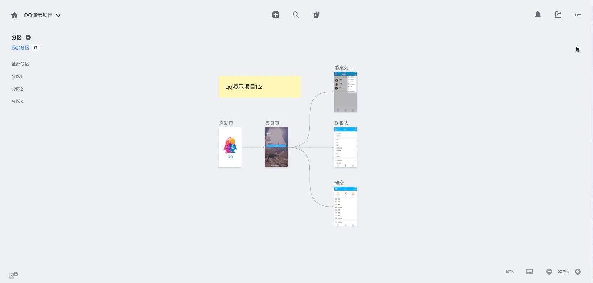

# 八.隐藏的黑科技
---
## 1.什么是隐藏的黑科技

隐藏的黑科技，是蓝湖的一些隐藏的选项与功能。

## 2.打开位置

点击进入项目画布，点击右上方“设置”按钮，选择【隐藏的黑科技】，可以看到一些隐藏的选项和功能。 

👇

## 3.高对比度外观

默认状态下，鼠标移至画布上设计图、文字卡片时，边缘处出现蓝色边框。 

打开此项开关，当鼠标滑至某张设计图或文字卡片时，边缘处替换为较深的灰色阴影。 

👇

## 4.自由缩放

默认状态下，缩放画布需使用“Crtl+鼠标滚轮”； 

打开此项开关，使用“鼠标滚轮”即可缩放画布。 

## 5.传统框选模式

默认状态下，框选设计图需使用“Shift+鼠标左键”； 

打开此项开关，使用“鼠标左键”即可框选设计图。 

## 6.重命名按钮

默认状态下，在画布上无法修改设计图名称； 

打开此项开关，鼠标滑过设计图名称即可出现“修改”按钮，点击此按钮可以修改设计图名称。 

👇

## 7.用颜色标记最近上传的设计图

默认状态下，最新上传的设计图会出现在画布最上方，但是拖拽至其他地方后，很难分辨出哪几张设计图是最新上传的。 

打开此项开关，最近3小时内或最新上传的10张设计图会被颜色标记出来。 

👇

## 8.焦距分区

默认状态下，选中一个分区时，其他分区内容依旧会显示； 

打开此项开关，选中一个分区时，其他分区内容会隐藏，有利于页面加快响应速度。 

## 9.显示分区内容数量

默认状态下，分区列表只显示【分区名称】； 

打开此项开关，分区列表中【分区名称】后面会显示该分区下设计图数量。 

👇

