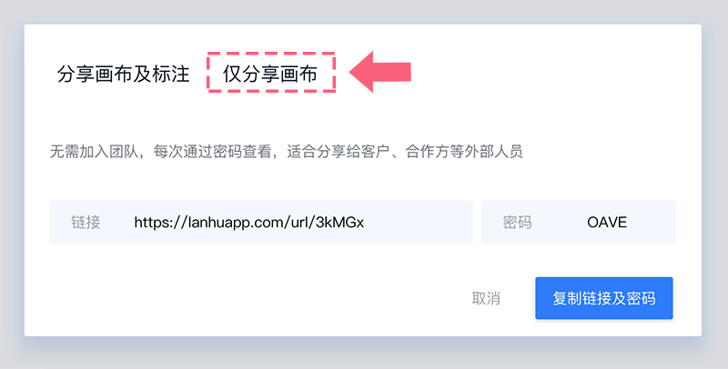

# --分享画布

点击右上角的【更多】，选择【分享项目】； 

👇

\*\*\*\*

**① 选择【分享画布及标注】** 

分享给团队成员，可查看标注、原型等项目内容； 

直接复制链接，分享给团队成员即可。 

👇

💌 该链接会同时邀请加入团队，再次自行登录后即可查看，不用多次重复分享；

该链接14天内有效。

**② 选择【仅画布】** 

分享给客户等团队外部人员，仅可查看画布内容； 

复制链接及密码，分享给客户等外部人员即可，他们无需加入团队，每次通过密码查看。 （该链接长期有效） 

👇

  

