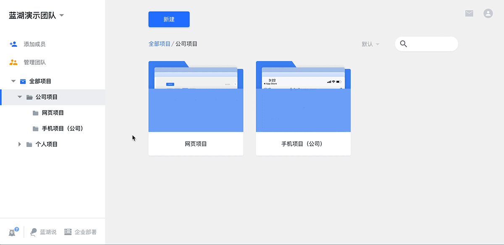

# 二.画布的使用
---
## 1.设计图管理

### 1.1 框选设计图

按住 Shift + 鼠标左键选择多张设计图;

鼠标右键拖拽可框选设计图 ;

框选后，可以选左对齐、右对齐、居中对齐等自动对齐选项，排列设计图。

👇 

### 1.2 上传设计图

通过蓝湖 Sketch 插件、 Photoshop 插件或者 Adobe XD 插件一键上传设计图。

### 1.3 下载设计图

选中需要下载的设计图，或者框选设计图，右键菜单，即可下载选中的设计图。

（还可以一次选中多张设计图进行下载）

👇

### 1.4 复制设计图
选中需要复制的设计图/文字卡片，右键菜单；

或使用快捷键“ Ctrl / Cmd + C ”复制， “ Ctrl / Cmd + V ”粘贴 或右键菜单粘贴，

即可复制该设计图当前版本/文字卡片。

👇
图丢了，再次链接一下，抱歉！！！！！

### 1.5 删除设计图

选中要删除的设计图，右键菜单，或使用快捷键 “delete” 键即可删除该设计图及其所有历史版本、批注等内容。 

👇

删除设计图之后，点击画布右下角“撤销”图标，即可撤销操作。 

👇

💌当页面刷新后 就无法再执行 “撤销”命令了，请谨慎删除操作。

### 1.6 设计图重命名

点设计图名称前的【修改】图标，或者选中需要重命名的设计图，右键菜单，即可对该设计图进行重新命名。

 👇

### 1.7 移动设计图

鼠标左键长按设计图不放，可随意移动； 

鼠标右键可框选多张设计图，随意拖拽移动。 

👇

移动设计图之后，点击画布右下角“撤销”图标，即可撤销操作。 

👇

💌当页面刷新后 就无法再执行 “撤销”命令了。

### 1.8 搜索设计图 
点击画布上方“搜索”图标，输入设计图名称即可。

👇
图丢了！！！

💌设计图搜索功能支持拼音。

👇
图丢了！！！

💌PS：

单击设计图，即可在画布内定位展示；

双击设计图，可打开当前设计图的标注页面。

### 1.9 设计图全览

使用快捷键“F”，即可全览画布上所有的设计图。 

👇

---
## 2.设计图分组

### 2.1 添加分组

点击画布左侧工具栏【添加分组】，或使用快捷键“G”；

点击选择要添加至分组的设计图，然后【确定】 ；

输入“分组名称”，点击【确定】即可。

 👇

### 2.2 编辑分组

点击左侧分组列表中，分组名称旁边的“设置”按钮，进入分组编辑模式； 

👇

**① 添加/删减设计图** 

在画布上，选择放进分组的设计图，即将设计图添加至该分组； 

将原来选中的设计图的“√”点掉，即将该设计图移出该分组。

 👇

**②修改名称** 

左上角分组名称旁边的“笔”按钮，输入分组新名称即可。 

👇

**③ 删除** 

点击右上角的“删除”按钮即可删除分组。

 👇

**④ 修改排序** 

左侧分组列表中，鼠标左键选中分组名称拖拽到合适位置。

👇

💌不打开编辑模式 也可修改分组排序。

---
## 3.设计图的状态图

我们经常会遇到同一页面、但表现不同情况的设计图 。\(例如无网络、未登录等状态\)

把这些图拖拽合并为状态图，就可以大大地方便团队理解和查看。

### 3.1 添加状态图

把是状态图的设计图拖拽至设计图的上方覆盖，即可生成状态图，设计图右侧标签可切换。

 👇

### 3.2 取消状态图

拖拽任意一个子标签出来（非第一个耳朵）即可取消。

 👇

### 3.3删除状态图

选中右侧标签后，按“delete”即可删除该状态图。 

👇

---
## 4.画布管理

### 4.1 拖拽整块画布

画布空白处鼠标左键按下拖动，可快速拖拽画布；

💌按在设计图上 会移动设计图。

 👇

或长按“空格”键，进入抓手模式，点击画布任意地方都可以拖拽画布。 

👇

### 4.2 分享画布

点击右上角的【更多】，选择【分享项目】； 

👇

**① 选择【分享画布及标注】** 

分享给团队成员，可查看标注、原型等项目内容； 

直接复制链接，分享给团队成员即可。 

👇

💌 该链接会同时邀请加入团队，再次自行登录后即可查看，不用多次重复分享；

该链接14天内有效。

**② 选择【仅画布】** 

分享给客户等团队外部人员，仅可查看画布内容； 

复制链接及密码，分享给客户等外部人员即可，他们无需加入团队，每次通过密码查看。 （该链接长期有效） 

👇

  

---
## 5.文字卡片

点击画布上方【＋】图标，选择【文字卡片】，或使用快捷键 “T”，单击画布空白处，即可创建“文字卡片”。 

文字卡片大小可拖拽选中后的6个控制柄根据需求随意调整。

 👇

---
## 6.逻辑连线

鼠标左键分别点击两张设计图，便可在它们中间绘制一条跳转连线。 该连线可 一对多 展示设计图关系。

👇

---
## 7.项目文档

与项目相关的本地文件和文档链接，都可添加至“项目文档”，该项目内所有成员都可查看，使项目文件和设计图衔接更紧密，资源更整合。

💌 项目文档支持以下文件格式：

Axure 压缩包 / Word / Excel / PowerPoint / PDF / 任意链接

点击画布连线页最上方【项目文档】图标，即可打开【项目文档】页。

👇

### 7.1 添加文件/链接

点击“项目文档”右上角的【添加】图标，即可添加文件/链接。

**· 添加文件**

选择【添加文件】，点击【上传文件】，选择需要上传的文件内容，上传成功后，输入文件名称，点击【确定】，即可成功添加文件。

👇

**· 添加链接**

选择【添加链接】，复制粘贴文件所属链接地址，输入链接文档名称，点击【确定】，即可成功添加链接。

👇

### 7.2 查看文件

双击“项目文档”页的文件名称，即可在新页面打开已上传的文件/链接。

👇

### 7.3 删除文件/链接

进入“项目文档”页，点击已上传文件/链接右上角的【更多】图标，选择【删除】，即可删除已上传的文件/链接。

👇

