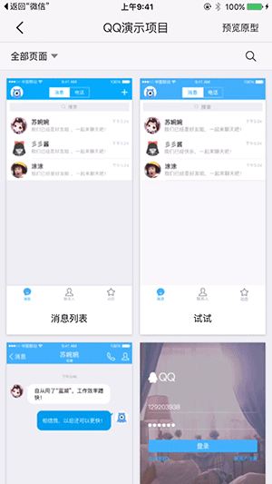

# 九.手机 APP

## 1.下载

iOS版可在 App Store 中搜索“蓝湖”直接下载； 

安卓版可在各大应用市场中搜索“蓝湖”直接下载； 

或在蓝湖首页左侧工具栏下载。 

👇

## 2.查看设计图

输入蓝湖帐号、密码即可登录； 

进入【团队】——【项目】，即可查看该项目下所有设计图。 

👇

## 3.批注评论

点击设计图，进入设计图详情页，点击左下方【打点评论】，还能 @相关成员，即可以在设计图上创建“批注评论”，可以查看该设计图的批注评论，也可以创建批注评论。 

点击右上方【全部评论】，即可查看该设计图所有的批注评论。 

👇

## 4.设计图分享

点击设计图右上方【分享】，可以将设计图直接分享给同事进行预览和评论。 

👇

## 5.查看交互原型

点击设计图列表页，点击右上方【预览原型】，即可预览并操作该项目的原型。 

👇

