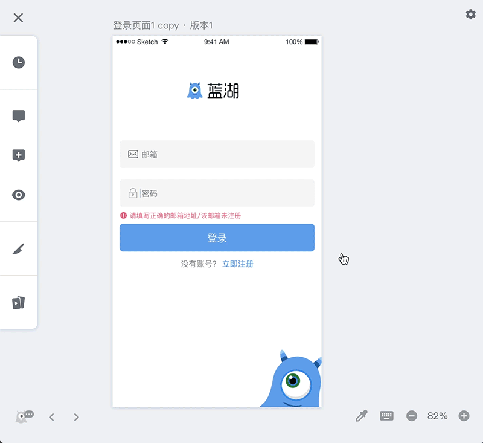
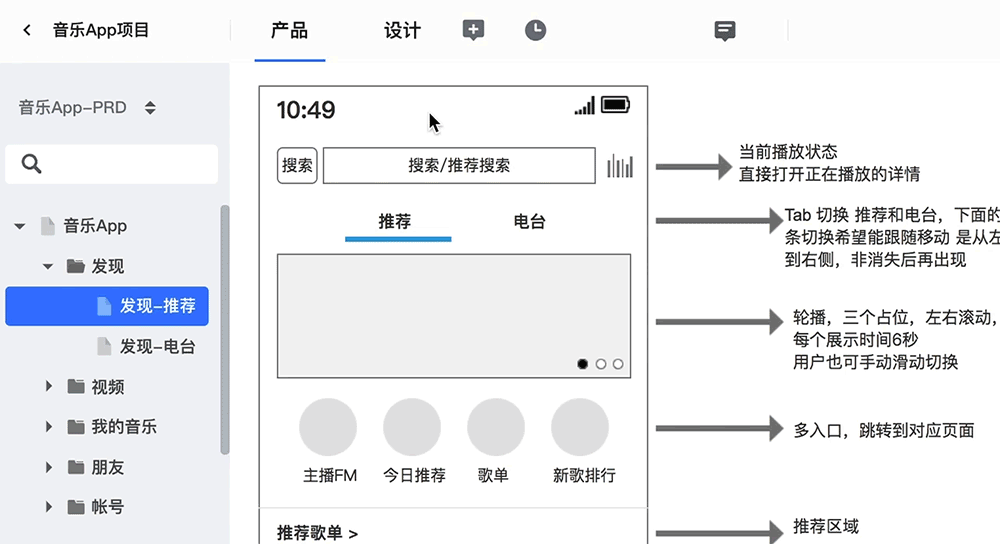

# 一分钟教程

## 一.上传设计图

### Sketch 插件

点击首页右上角的【下载】图标，打开后，即可下载蓝湖 Sketch 插件；安装后登录。

👇[** (下载蓝湖 Sketch 插件地址) **](https://lanhuapp.com/mac)

选择要上传的设计图，或者一键上传所有设计图；

上传后，即可实现自动标注、一键切图、设计图树状连线、制作交互原型、设计图沟通、同步 Sketch Prototyping 等操作。

### Adobe Photoshop 插件

点击首页右上角的【下载】图标，打开后，即可下载蓝湖 Photoshop 插件；安装后登录。

➡️[**（下载蓝湖 Photoshop 插件地址）**](https://lanhuapp.com/ps)

选择要上传的设计图，或者一键上传所有设计图；

上传后，即可实现自动标注、一键切图、设计图树状连线、制作交互原型、设计图沟通等操作。

### Adobe XD 插件

点击首页右上角的【下载】图标，打开后，即可下载蓝湖 Adobe XD 插件；安装后登录。

➡️[**（下载蓝湖 Adobe XD 插件地址）**](https://lanhuapp.com/xd)

选中需要导出的画板，导出到【蓝湖】，在【蓝湖 XD】程序中上传设计图；

上传后，即可实现自动标注、一键切图、设计图树状连线、制作交互原型、设计图沟通等操作。

### 上传本地设计图

点击画布页上方的【添加】图标，选择【设计图】，选择需要上传的图片，即可将本地设计图上传到蓝湖。

👇

## 二. 设计图树状连线

设计图通过插件上传之后，进入蓝湖的【设计】页，

点击上方的【连线 L】图标，进入设计图连线模式，可将设计图随意拖动摆放，绘制页面间跳转逻辑连线，直观展现产品逻辑。

👇

## 三. 自动标注

设计图通过插件上传之后，即可在设计图详情页查看设计图每一个元素的颜色、大小、间距、字号等信息，团队内的成员可以随时查看，并可直接复制相关代码；

如果设计图有修改、更新，蓝湖也能自动添加最新版本。

👇

&nbsp;  
&nbsp;
&nbsp;  
&nbsp;
还能进行【标注多选】，选择多个元素，同时查看几个元素的标注信息；

&nbsp;  
&nbsp;
&nbsp;  
&nbsp;
选中元素后，按住  Alt 键即可查看元素所占的百分比，还能查看该元素在整张设计图所占的百分比。

## 四.一键切图

同时支持 **Sketch、Photoshop 和 Adobe XD 。**

只需要通过蓝湖 Sketch / Photoshop / Adobe XD 插件标记需要生成的切图，上传设计图；

在设计图详情页，你家工程师就可以一键下载多倍数切图文件。

👇

还可以选择【开启切图压缩】，点击【下载切图】，就可以将无损压缩的切图下载下来。

&nbsp;

---

&nbsp;  
&nbsp;

## 五.制作交互原型

将设计图通过插件上传之后，在蓝湖上可以制作跳转交互；

完成后，点击原型页的【演示】按钮，即可预览、操作制作好的原型，还可以选择预览原型的设备机型模板。

👇

点击原型预览界面左侧的“分享”按钮，直接复制原型链接，发送给同事，同事在电脑端、手机端都可以直接打开预览和操作；

👇

## 六.产品文档共享

产品文档上传到蓝湖后，团队成员可以在线查看、基于文档进行讨论；

无需导出 Axure HTML ，一键快速上传；当 Axure 文档有更新，重新上传后，无需打包发送，团队成员每次打开都是最新。还能在线收集反馈，随时查看历史版本，让文档更高效。

👇

团队成员还可以对产品文档进行在线讨论。

👇

蓝湖还会为你保存产品文档的历史版本，避免文件丢失造成的损失；在内容有更新的页面，团队成员还可以对比查看版本间的页面变化。

👇

P.S.

1.蓝湖「产品文档共享」支持以下格式：Axure / Word / PDF / Excel / PPT / 外部文档链接。

2.”产品文档批注功能“支持以下格式文档：Axure / Word / PDF。

3.”产品文档历史版本管理“支持以下格式：Axure / Word / PDF / Excel / PPT。

## 七.项目资源库管理

和项目有关的文档链接/本地文件，上传到蓝湖【资源库】之后，团队成员都能在蓝湖快速打开、查看、下载。

💌 【资源库】支持以下文件格式：

Excel / PPT / 任意链接
👇

## 八.蓝湖手机 APP

下载蓝湖手机 APP，登录蓝湖帐号后，进入【团队】→【项目】后，即可实现随时随地查看该项目下所有的设计图、分享设计图、查看交互原型等操作；

还可以查看设计图批注或打点评论。
