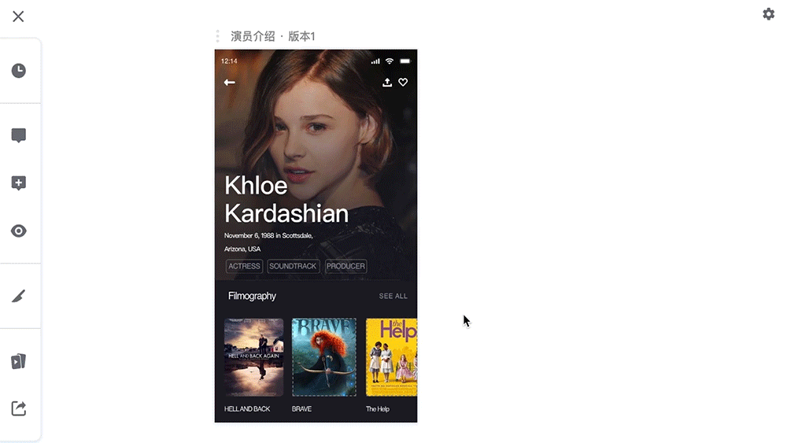
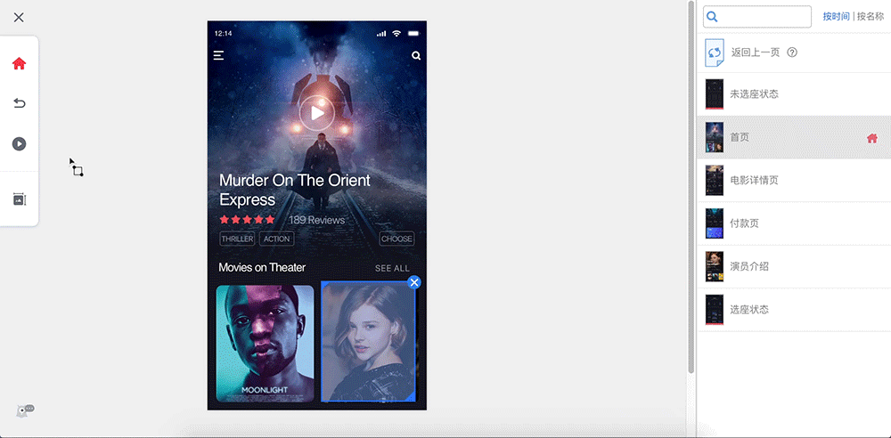

# 快速使用蓝湖

---
## 一.上传设计图

### - Sketch 插件
在项目首页左侧工具栏中，点击【相关下载】，即可下载蓝湖 Sketch 插件；安装后登录。

**➡️**[**（蓝湖 Sketch 插件下载地址）**](https://lanhuapp.com/mac)\*\*\*\*

选择要上传的设计图，或者一键上传所有设计图；

上传后，即可实现自动标注、一键切图、设计图树状连线、制作交互原型、设计图沟通、同步 Sketch Prototyping等操作。

### - Adobe Photoshop 插件

在项目首页左侧工具栏中，点击【相关下载】，即可下载蓝湖 Photoshop 插件；安装后登录。

➡️[**（下载蓝湖 Photoshop 插件地址）**](https://lanhuapp.com/ps)\*\*\*\*

  
选择要上传的设计图，或者一键上传所有设计图；

上传后，即可实现自动标注、一键切图、设计图树状连线、制作交互原型、设计图沟通等操作。

### - Adobe XD 插件

在项目首页左侧工具栏中，点击【相关下载】，即可下载蓝湖 Adobe XD 插件；安装后登录。

➡️[**（下载蓝湖 Adobe XD 插件地址）**](https://lanhuapp.com/xd)\*\*\*\*

  
****选中需要导出的画板，导出到【蓝湖】，在【蓝湖 XD】程序中上传设计图；

上传后，即可实现自动标注、一键切图、设计图树状连线、制作交互原型、设计图沟通等操作。

---
## 二. 设计图树状连线

设计图通过插件上传之后，在蓝湖提供的画板，可将设计图随意拖动摆放，绘制页面间跳转逻辑连线，直观展现产品逻辑。

👇

---
## 三. 自动标注

设计图通过插件上传之后，即可在设计图详情页查看设计图每一个元素的颜色、大小、间距、字号等信息，团队内的成员可以随时查看，并可直接复制相关代码；

如果设计图有修改、更新，蓝湖也能自动添加最新版本。

👇

---
## 四.一键切图

同时支持 **Sketch、Photoshop 和 Adobe XD 。**

只需要通过蓝湖 Sketch / Photoshop / Adobe XD 插件标记需要生成的切图，上传设计图；

在设计图详情页，你家工程师就可以一键下载多倍数切图文件。

👇

---
## 五.制作交互原型

将设计图通过插件上传之后，在蓝湖上可以制作跳转交互；

完成后，点击原型页的【演示】按钮，即可预览、操作制作好的原型，还可以选择预览原型的设备机型模板。

👇

---
## 六.项目文档管理

和项目有关的文档链接/本地文件，上传到蓝湖【项目文档】之后，团队成员都能在蓝湖快速打开、查看。

💌 项目文档支持以下文件格式：

Axure 压缩包 / Word / Excel / PowerPoint / PDF / 任意链接

👇

---
## 七.蓝湖手机 APP

下载蓝湖手机 APP，登录蓝湖帐号后，进入【团队】→【项目】后，即可实现随时随地查看该项目下所有的设计图、分享设计图、查看交互原型等操作；

还可以查看设计图批注或打点评论。
